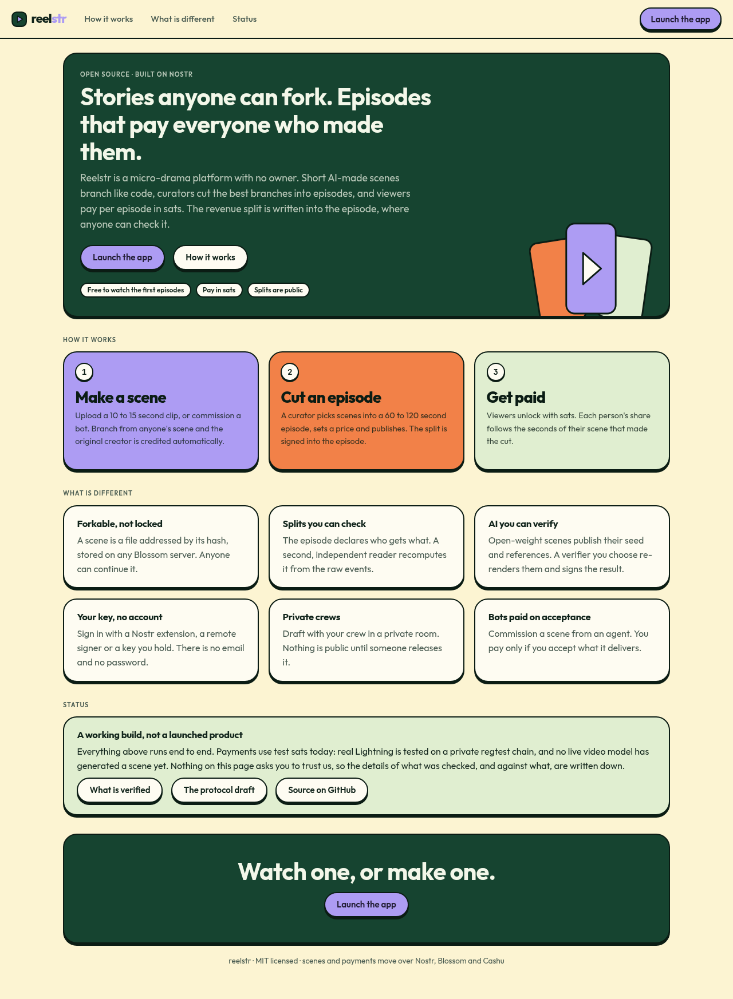

# Reelstr

**Open-source Pocket FM on Nostr.** Short AI-generated scenes that anyone can fork, episodes assembled by curators, and per-episode payments in sats, with the revenue split written into signed events that anyone can verify.

> Status: a complete local build and a working demo, not a launched product. Nothing has run on a public relay or with real money yet. Read [Honest status](#honest-status) before relying on any of it.



## The idea

Serialized short drama (the Pocket FM / ReelShort model) works, but the platforms own the audience, the catalog and the money. Reelstr asks what it looks like when none of those are owned by one company.

- **Scenes are forkable.** A scene is a 10 to 15 second clip with its prompt, model, seed and references published as a manifest. Anyone can continue it or branch it. The result is a story tree, not a single line.
- **Curators make episodes.** A curator picks scenes from the tree, trims and orders them into a 60 to 120 second episode, sets a price and publishes it.
- **Money follows the signed split.** Each episode declares who gets what share (creators by seconds used, curator, host). Viewers pay per episode with Cashu ecash or Lightning, and payouts are published as receipts anyone can check.
- **Nothing is locked in.** Everything is Nostr events plus content-addressed Blossom blobs. Any relay, any Blossom server, any client.

## What is in the box

| Piece | What it does |
| --- | --- |
| **Web app** (PWA) | One app with tabs. Watch: vertical player, series pages, paywall, ratings, reports, captions. Create: stories and scene tree, fork and continue, curator desk with timeline editor, crew rooms, agents, earnings. Wallet and settings are shared. A public landing page for signed-out visitors |
| **Protocol** | Event kinds, builders, validators and fixtures for stories, scenes (NIP-71 addressable video), cuts, series, payouts and jobs. Draft spec in [`docs/nip/reelstr.md`](docs/nip/reelstr.md) |
| **Reference relay** | Go (khatru) with a kind allowlist, proof-of-work floor and timestamp window, all advertised in NIP-11 |
| **Media service** | Normalizes clips (1080x1920, 30 fps, H.264, loudness), renders hash-stable HLS ladders with optional AES-128, mirrors blobs, generates draft captions locally with speech-to-text |
| **Indexer** | Postgres or PGlite read model rebuilt from relays alone: story trees, credits, earnings, ratings, web-of-trust inbox |
| **Key server and split service** | Releases episode keys for a nutzap or Lightning payment, and pays creators out by nutzap or Lightning address with signed receipts. The split service is custodial and is off unless you acknowledge that |
| **Generation agent and verifier** | An agent with its own key takes paid scene jobs. A verifier re-renders open-weight scenes from their manifest and publishes a signed "Source Verified" label |
| **Crew rooms** | Private NIP-29 rooms for drafting before a scene goes public |

Specs touched: NIP-01, 07, 11, 13, 29, 32, 42, 44, 46, 47, 56, 57, 60, 61, 71, 98, plus Blossom (BUD-01/02/04/11) and Cashu.

## Try it

You need [bun](https://bun.sh), Go, ffmpeg, Python 3 and Chrome. For the real mint and captions, also see `requirements-mint.txt` and `requirements-asr.txt`.

```sh
bun install
(cd infra/blossom && npm install && npm rebuild better-sqlite3)
bun run demo
```

About two minutes later it prints two URLs and three sign-in keys. Everything is local: a seeded story called "The Last Signal" with a branching scene tree, a free and a paid episode, an AI-made scene carrying a Source Verified badge, an agent you can commission, and a mint that hands out test sats. Walkthrough in [`docs/DEMO.md`](docs/DEMO.md).

```sh
bun run check       # lint, types, 203 tests
bun run test:e2e    # 14 headless-browser tests against the built apps
```

## Honest status

Each requirement is graded by how it was checked, in [`docs/STATUS.md`](docs/STATUS.md): real, mock-of-real, fake, or untested.

**Verified against real systems:** a real Cashu mint (Nutshell), real Postgres 17, real containers, real Chrome, and real LND nodes on a private regtest chain (invoices, payments, failures, pay-to-unlock, payouts). Measured on localhost: 500-scene tree in about 70 to 110 ms, unlock to playback about 280 ms, a 2-minute episode renders in about 36 s.

**Not verified:**
- Mainnet Lightning, phoenixd, and real fees on micropayments
- A live video model (the agent has only run against a mock; footage in the demo is generated placeholders)
- Real NIP-07 extensions and NIP-46 bunkers (stand-ins built from the spec were used)
- Safari and iPhone, and any real mobile network
- Caption accuracy on real human speech

**Not solved by code:** custody and money transmission law, India VDA tax, likeness rights, and the biggest one, whether anyone wants this. Fork rate and unlock conversion are the real tests.

Where the build departs from the original plan, and why, is in [`docs/DEVIATIONS.md`](docs/DEVIATIONS.md). Notably: encrypted episodes use AES-128 HLS, which is leak-tolerant (a paying viewer can share the key), not DRM.

## Repository

```
apps/        studio, cinema
packages/    protocol, nostr, blossom, media, wallet, bolt11, app-core, ui, testkit
services/    relay, crew, media, indexer, keys, split, agent (agent + verifier)
demo/        one-command seeded demo and smoke scripts
e2e/         headless Chrome tests, interop/  an independent Python reader
infra/       compose file, Blossom image, regtest notes
docs/        architecture, status, deviations, protocol draft, research
```

Architecture: [`docs/ARCHITECTURE.md`](docs/ARCHITECTURE.md). Design system: [`docs/DESIGN.md`](docs/DESIGN.md). Market and feasibility research: [`docs/research.md`](docs/research.md).

## Contributing

Issues and forks welcome. The most useful things right now: running it against a real video model, testing with real signers and on real phones, a second independent client for the protocol, and review of the NIP draft.

## License

MIT, see [`LICENSE`](LICENSE).
