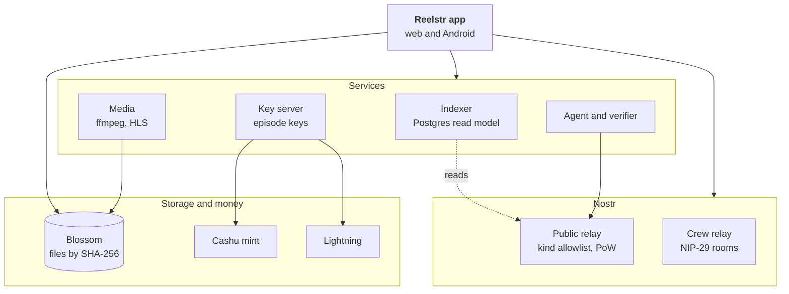

<p align="center">
  
</p>

<h3 align="center">Open-source Pocket FM on Nostr</h3>

<p align="center">
  Short AI-made scenes anyone can fork, episodes cut by curators, and per-episode payments in sats,<br>
  with the revenue split written into signed events that anyone can verify.
</p>

<p align="center">
  <a href="https://reelstr.ansht.workers.dev"></a>
  <a href="https://github.com/Priyanshubhartistm/reelstr/releases/latest"></a>
  <a href="docs/ARCHITECTURE.md"></a>
  <a href="docs/nip/reelstr.md"></a>
  <a href="docs/VERIFICATION.md"></a>
</p>

<p align="center">
  
  
  
  
  
  
  
  <a href="LICENSE"></a>
</p>

<p align="center">
  
</p>

<p align="center">
  <a href="#what-it-is-in-plain-words">📖 What it is</a> &nbsp;·&nbsp;
  <a href="#how-it-fits-together">⚙️ How it works</a> &nbsp;·&nbsp;
  <a href="#try-it">🚀 Try it</a> &nbsp;·&nbsp;
  <a href="https://github.com/Priyanshubhartistm/reelstr/releases/latest">📱 Android app</a> &nbsp;·&nbsp;
  <a href="#testnet-release">✅ Testnet release</a>
</p>

> **Testnet release.** Every feature is built and running on testnet: free test sats, a faucet, and sample clips you can replace with your own. Going to mainnet is the next step, listed in the [Roadmap](#roadmap)).

## What it is, in plain words

Serialized short drama (the Pocket FM and ReelShort model) works, but the platforms own the audience, the catalog and the money. Reelstr asks what happens when no company owns them.

1. **Make a scene.** Upload a 10 to 15 second clip, or commission a bot to make one. Anyone can continue or branch off anyone else's scene, so a story becomes a tree.
2. **Cut an episode.** A curator picks scenes from the tree, orders and trims them into a 60 to 120 second episode, sets a price and publishes it.
3. **Get paid.** Viewers watch the first episodes free, then pay a few sats per episode. Each person's share follows the seconds of their scene in the cut, and the split is public.

Everything is Nostr events plus content-addressed Blossom blobs, so any relay, any media server and any client can take part.

## How it fits together



The relay is the source of truth; the indexer is a cache that can be rebuilt from relays alone. The event kinds and the pay, fork and agent flows are in [`docs/ARCHITECTURE.md`](docs/ARCHITECTURE.md).

## What is in the box

| | |
| --- | --- |
| 🎬 **Web app** | Watch, fork, curate, pay. Player, paywall, story tree, curator desk, crew rooms, agents, wallet |
| 📱 **Android app** | The same app in a [Capacitor](apps/mobile) shell |
| 🧩 **Protocol** | Event kinds, builders, validators, fixtures. Draft spec: [`docs/nip/reelstr.md`](docs/nip/reelstr.md) |
| 📡 **Relays** | A reference relay (kind allowlist, proof-of-work floor) and a NIP-29 crew relay for private drafts |
| 🎞️ **Media** | Normalizes clips, renders hash-stable HLS (optionally AES-128), drafts captions locally |
| 🗂️ **Indexer** | Story trees, credits, earnings and ratings, rebuilt from relays |
| ⚡ **Payments** | A key server that releases episode keys for ecash or Lightning, and an optional split service with signed receipts |
| 🤖 **Agents** | Bots that take paid scene jobs, and a verifier that signs "Source Verified" |

Specs: NIP-01, 07, 11, 13, 29, 32, 42, 44, 46, 47, 56, 57, 60, 61, 71, 98, Blossom (BUD-01/02/04/11) and Cashu.

## Try it

You need [bun](https://bun.sh), Go, ffmpeg, Python 3 and Chrome. For the real mint and captions see `infra/python/requirements-mint.txt` and `infra/python/requirements-asr.txt`.

```sh
bun install
(cd infra/blossom && npm install && npm rebuild better-sqlite3)
bun run demo
```

About two minutes later it prints two URLs and three sign-in keys. Everything is local: a seeded story, "The Last Signal", with a branching scene tree, a free and a paid episode, an AI-made scene with a Source Verified badge, an agent you can commission, and a mint that hands out test sats. Walkthrough: [`docs/DEMO.md`](docs/DEMO.md).

```sh
bun run check       # lint, types, unit tests (215)
bun run test:e2e    # 19 headless-browser tests
```

The deployed demo runs as a **testnet**: a badge, a faucet for 500 free test sats, and a four-step guide. Record your own showcase with [`docs/SHOWCASE.md`](docs/SHOWCASE.md).

## Android app

**[Download the APK from the latest release](https://github.com/Priyanshubhartistm/reelstr/releases/latest)**, open it on your phone and sign in. It is the same app as the website, in a Capacitor shell pointed at the testnet backend.

To build it yourself, `infra/android` builds the APK in a container (Docker only):

```sh
docker build -t reelstr-android infra/android
mkdir -p out && docker run --rm --cpus 1 --memory 5g -v "$PWD:/src:ro" -v "$PWD/out:/out" reelstr-android
```

or from `apps/mobile` with Android Studio: `bun run sync`, then `bun run android`. Point it at your own backend with `B=https://your-host/reelstr bun run sync`. More in [`apps/mobile/README.md`](apps/mobile/README.md).

## Deploy

The web app is static and deploys as a Cloudflare Worker with assets. The backend is Docker Compose behind a reverse proxy. Steps and reverse-proxy notes are in [`infra/README.md`](infra/README.md).

## Testnet release

Everything is built and running on testnet: watch, fork, curate, pay, split, agents, crew rooms, wallet, web and Android. What was tested, and how, is in the [verification report](docs/VERIFICATION.md).

**Tested against real systems:** a Cashu mint (Nutshell), Postgres 17, containers, Chrome and WebKit, LND nodes on a private regtest chain, and **Lightning routing on the Mutinynet public signet**: our own channels, 27 routed payments, and the key server's backend paying invoices end to end. Routing costs a flat ~2 sats whatever the amount (9.5% of a 21-sat payment, 1% of 210, 0.2% of 1,000), so unlocks use ecash and Lightning handles top-ups and batched payouts.

**Security model:** episode keys are issued per payment (AES-128 HLS), and a DRM provider can be plugged in at the key server. The split service holds funds between unlock and payout, so it is off by default and needs `acknowledgeCustody`; check local money-transmission rules before enabling it. Details in [`docs/ARCHITECTURE.md`](docs/ARCHITECTURE.md#security-model) and [`docs/DESIGN-DECISIONS.md`](docs/DESIGN-DECISIONS.md).

## Roadmap

- Connect a live video model (Wan 2.2 via fal, or Gemini Veo; both adapters are included).
- Point the wallet at a mainnet mint and Lightning.
- Publish the Android app to Google Play. iOS runs as the web app.
- Submit the protocol draft as a NIP.

## Repository

```
apps/
  web/        the web app (React, Vite)
  mobile/     Android and iOS shell (Capacitor)
packages/     protocol, nostr, blossom, bolt11, media, wallet, app-core, ui, testkit
services/     relay, crew, media, indexer, keys, split, agent (agent and verifier)
demo/         one-command demo (src), browser checks (smoke), tooling (tools)
e2e/          headless-browser tests
interop/      independent Python reader and relay interop check
infra/        compose files, container images, Mutinynet node, deployment notes
docs/         architecture, verification, design decisions, design system, protocol draft
```

Every folder has its own README. Start with [`docs/README.md`](docs/README.md) and [`CONTRIBUTING.md`](CONTRIBUTING.md).

## Contributing

Issues and forks are welcome. Good places to help: connect a live video model, build another client for the protocol, review the NIP draft, and try the app on more devices. See [`CONTRIBUTING.md`](CONTRIBUTING.md).

## Team

- **Priyanshu Bharti**
  - GitHub: [@Priyanshubhartistm](https://github.com/Priyanshubhartistm)
  - LinkedIn: [Priyanshu Bharti](https://www.linkedin.com/in/priyanshu-bharti-441823229/)
- **Ansh Tyagi**
  - Email: [anshtyagi7845@gmail.com](mailto:anshtyagi7845@gmail.com)
  - GitHub: [@Ansh-699](https://github.com/Ansh-699)
  - LinkedIn: [Ansh Tyagi](https://www.linkedin.com/in/ansh-tyagi7845/)

## License

MIT, see [`LICENSE`](LICENSE).
