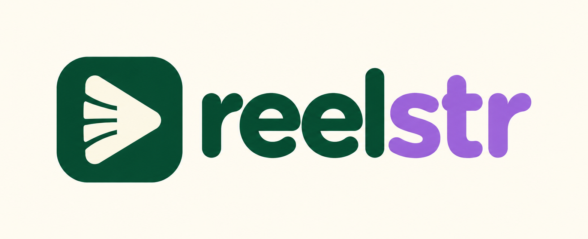
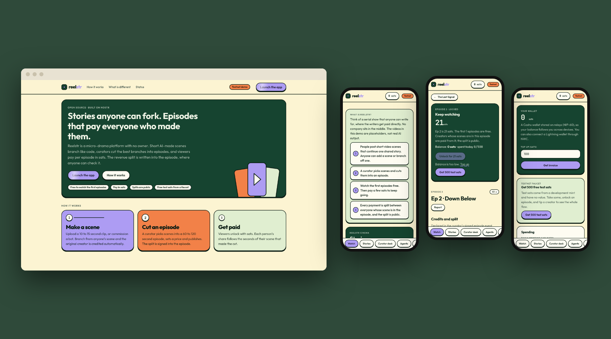
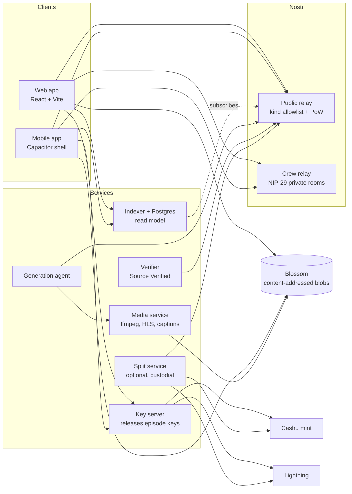
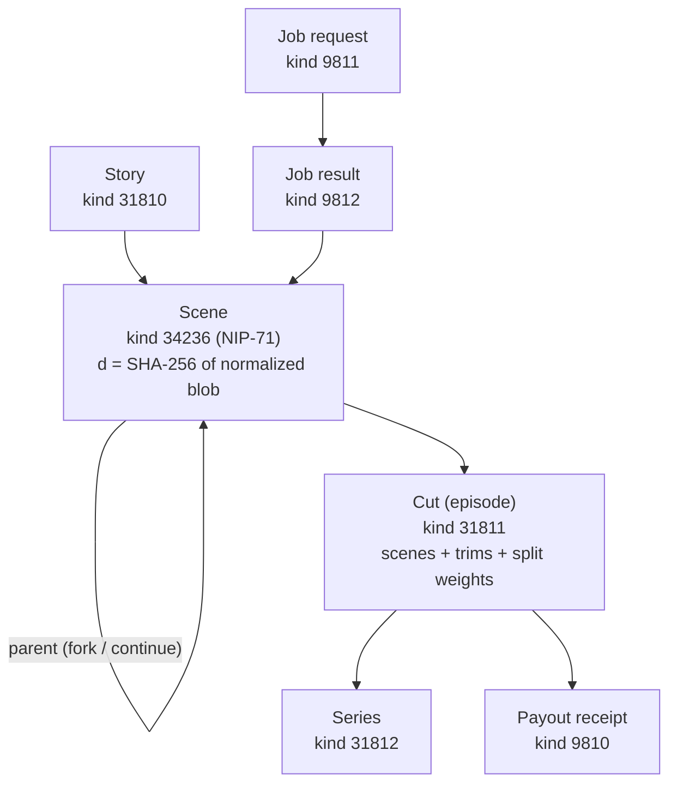
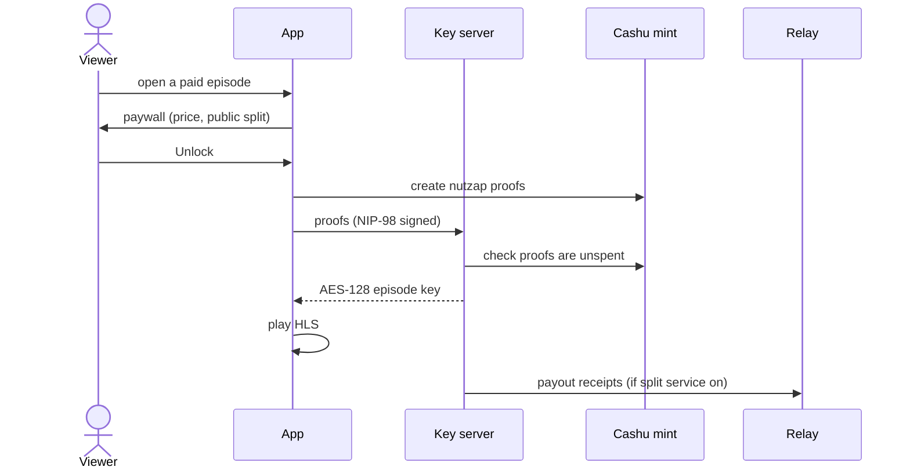
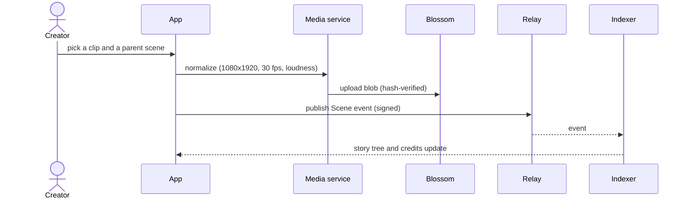
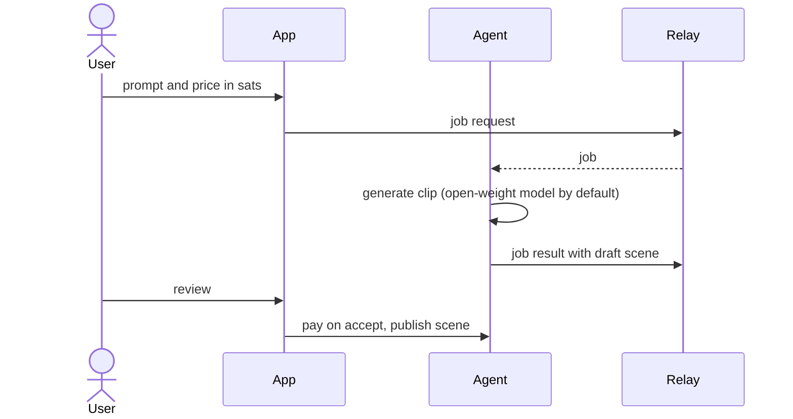

<p align="center">
  
</p>

<h3 align="center">Open-source Pocket FM on Nostr</h3>

<p align="center">
  Short AI-made scenes anyone can fork, episodes cut by curators, and per-episode payments in sats,<br>
  with the revenue split written into signed events that anyone can verify.
</p>

<p align="center">
  <a href="https://reelstr.ansht.workers.dev"></a>
  <a href="docs/ARCHITECTURE.md"></a>
  <a href="docs/nip/reelstr.md"></a>
  <a href="docs/STATUS.md"></a>
</p>

<p align="center">
  
  
  
  
  
  
  
  <a href="LICENSE"></a>
</p>

<p align="center">
  
</p>

<p align="center">
  <b><a href="#what-it-is-in-plain-words">What it is</a></b> ·
  <b><a href="#how-it-fits-together">How it works</a></b> ·
  <b><a href="#try-it">Try it</a></b> ·
  <b><a href="#mobile-app">Mobile</a></b> ·
  <b><a href="#honest-status">Status</a></b>
</p>

> **Status:** a complete build and a working testnet demo, not a launched product. Nothing has run on a public relay or with real money. The demo uses free test sats and placeholder videos. Read [Honest status](#honest-status) before relying on any of it.

## What it is, in plain words

Serialized short drama (the Pocket FM and ReelShort model) works, but the platforms own the audience, the catalog and the money. Reelstr asks what happens when no company owns them.

1. **Make a scene.** Upload a 10 to 15 second clip, or commission a bot to make one. Anyone can continue or branch off anyone else's scene, so a story becomes a tree.
2. **Cut an episode.** A curator picks scenes from the tree, orders and trims them into a 60 to 120 second episode, sets a price and publishes it.
3. **Get paid.** Viewers watch the first episodes free, then pay a few sats per episode. Each person's share follows the seconds of their scene in the cut, and the split is public.

Everything is Nostr events plus content-addressed Blossom blobs, so any relay, any media server and any client can take part.

## How it fits together



The relay is the source of truth; the indexer is a cache that can be rebuilt from relays alone. More in [`docs/ARCHITECTURE.md`](docs/ARCHITECTURE.md).

### Event model



### Watch and pay



### Create and fork



### Commission a bot



## What is in the box

| Piece | What it does |
| --- | --- |
| **Web app** | One app. Watch: player, series pages, paywall, ratings, reports, captions. Create: stories and scene tree, fork and continue, curator desk with timeline editor, crew rooms, agents, earnings. Shared wallet and settings. Public landing page |
| **Mobile app** | The same app in a [Capacitor](apps/mobile) shell for Android and iOS, with a bottom tab bar and safe-area handling |
| **Protocol** | Event kinds, builders, validators and fixtures. Draft spec in [`docs/nip/reelstr.md`](docs/nip/reelstr.md) |
| **Reference relay** | Go (khatru) with a kind allowlist, proof-of-work floor and timestamp window, advertised in NIP-11 |
| **Media service** | Normalizes clips, renders hash-stable HLS ladders with optional AES-128, mirrors blobs, drafts captions locally |
| **Indexer** | Postgres or PGlite read model rebuilt from relays: story trees, credits, earnings, ratings, web-of-trust inbox |
| **Key server and split service** | Releases episode keys for a nutzap or Lightning payment. The split service pays creators out with signed receipts; it is custodial and off unless you acknowledge that |
| **Agent and verifier** | An agent with its own key takes paid scene jobs. A verifier re-renders open-weight scenes from their manifest and publishes a "Source Verified" label |
| **Crew rooms** | Private NIP-29 rooms for drafting before a scene goes public |

Specs touched: NIP-01, 07, 11, 13, 29, 32, 42, 44, 46, 47, 56, 57, 60, 61, 71, 98, Blossom (BUD-01/02/04/11) and Cashu.

## Try it

You need [bun](https://bun.sh), Go, ffmpeg, Python 3 and Chrome. For the real mint and captions see `requirements-mint.txt` and `requirements-asr.txt`.

```sh
bun install
(cd infra/blossom && npm install && npm rebuild better-sqlite3)
bun run demo
```

About two minutes later it prints two URLs and three sign-in keys. Everything is local: a seeded story, "The Last Signal", with a branching scene tree, a free and a paid episode, an AI-made scene with a Source Verified badge, an agent you can commission, and a mint that hands out test sats. Walkthrough: [`docs/DEMO.md`](docs/DEMO.md).

```sh
bun run check       # lint, types, unit tests (215)
bun run test:e2e    # 19 headless-browser tests
```

The deployed demo runs as a **testnet**: a badge, a faucet for 500 free test sats, and a four-step guide. Record your own showcase with [`docs/SHOWCASE.md`](docs/SHOWCASE.md).

## Mobile app

`apps/mobile` wraps the web build in Capacitor, so the phone app and the website are one codebase.

```sh
cd apps/mobile
bun run sync        # builds the web app against the testnet backend, then cap sync
bun run android     # opens Android Studio
bun run apk         # debug APK: apps/mobile/android/app/build/outputs/apk/debug/
```

Point it at your own backend with `B=https://your-host/reelstr bun run sync`. iOS: open `apps/mobile/ios/App` in Xcode on a Mac.

**Build without Android Studio:** `infra/android` builds the debug APK inside a container, so the host only needs Docker:

```sh
docker build -t reelstr-android infra/android
mkdir -p out && docker run --rm --cpus 1 --memory 5g -v "$PWD:/src:ro" -v "$PWD/out:/out" reelstr-android
```

Status: the debug APK builds (4.7 MB, about 3 minutes on 1 CPU) and contains the current web bundle pointed at the testnet backend. It has **not been installed or run on a phone or emulator**, iOS has not been built, and nothing is in a store. Store release needs a Google Play account and signing key, and an Apple developer account.

## Deploy

The web app is static and deploys as a Cloudflare Worker with assets. The backend is Docker Compose behind a reverse proxy. Steps and the hardening that was needed are in [`infra/README.md`](infra/README.md).

## Honest status

Each requirement is graded by how it was checked in [`docs/STATUS.md`](docs/STATUS.md): real, mock-of-real, fake or untested.

**Verified against real systems:** a real Cashu mint (Nutshell), real Postgres 17, real containers, real Chrome, real LND nodes on a private regtest chain (invoices, payments, failures, pay-to-unlock, payouts).

**Not verified:**
- Mainnet Lightning, phoenixd, and real fees on micropayments
- A live video model (adapters for Wan 2.2 and Gemini Veo exist; the demo footage is generated placeholders)
- Real NIP-07 extensions and NIP-46 bunkers (stand-ins built from the spec were used)
- Safari, iPhone, the native mobile builds, and real mobile networks
- Caption accuracy on real human speech

**Not solved by code:** custody and money transmission law, India VDA tax, likeness rights, and whether anyone wants this. Fork rate and unlock conversion are the real tests.

Deviations from the original plan are in [`docs/DEVIATIONS.md`](docs/DEVIATIONS.md). Notably, encrypted episodes use AES-128 HLS, which is leak-tolerant (a paying viewer can share the key), not DRM.

## Repository

```
apps/        web (the app), mobile (Capacitor shell)
packages/    protocol, nostr, blossom, media, wallet, bolt11, app-core, ui, testkit
services/    relay, crew, media, indexer, keys, split, agent (agent + verifier)
demo/        one-command seeded demo, smoke scripts, screenshot tools
e2e/         headless Chrome tests; interop/  an independent Python reader
infra/       compose files, Blossom image, deploy notes
docs/        architecture, status, deviations, protocol draft, design, research
```

Design system: [`docs/DESIGN.md`](docs/DESIGN.md). Research: [`docs/research.md`](docs/research.md).

## Contributing

Issues and forks welcome. Most useful right now: running it against a real video model, testing with real signers and on real phones, a second independent client for the protocol, and review of the NIP draft.

## License

MIT, see [`LICENSE`](LICENSE).
