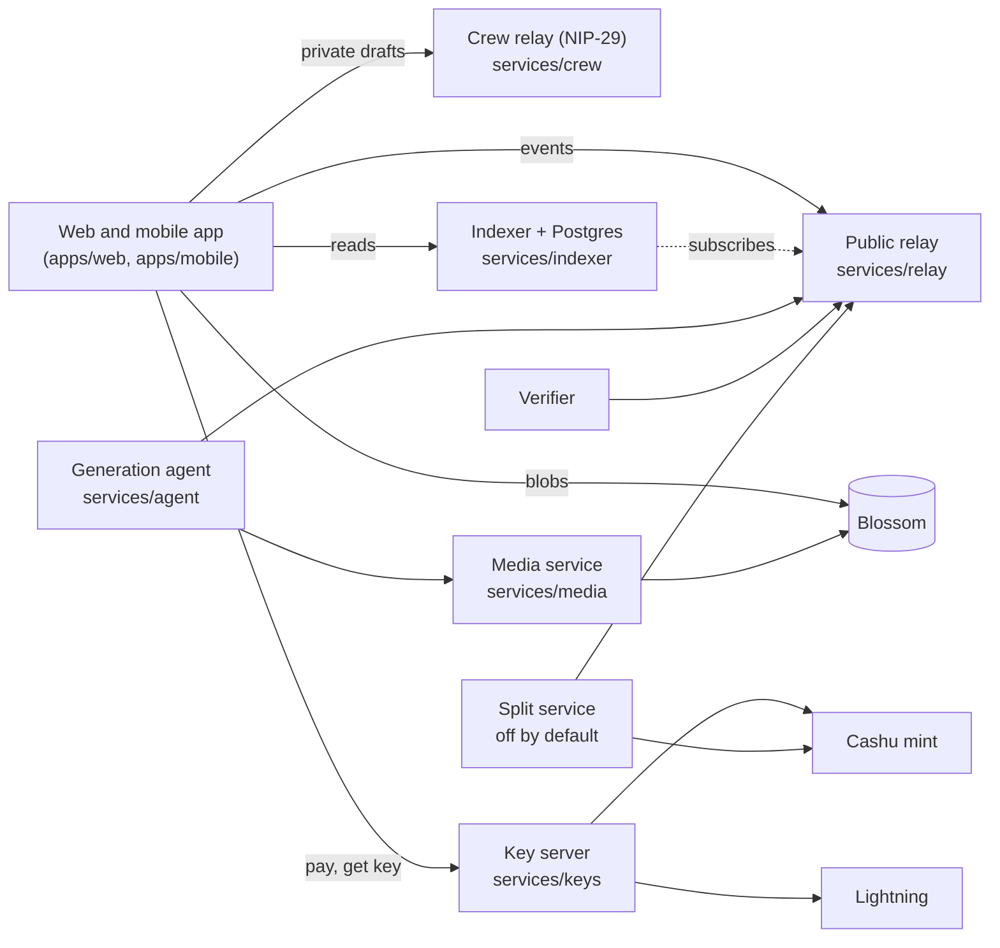

# Architecture

Apps and services meet on Nostr relays (events) and Blossom servers (media). Money is the one exception: the app pays a key server, which releases the episode key.

The event kinds, watch-and-pay flow, create-and-fork flow and bot-commission flow are drawn in the [README](../README.md#how-it-fits-together).

| Piece | Path | Role |
| --- | --- | --- |
| Protocol | `packages/protocol` | Kinds, builders, validators, split math, fixtures. Every other piece imports it. |
| Nostr client | `packages/nostr` | Signers (NIP-07, NIP-46, local), relay pool, PoW. |
| Blossom client | `packages/blossom` | Upload, mirror, hash-verified fetch. |
| Media | `packages/media` | ffmpeg: normalize scenes, render episodes (HLS ladder, AES-128). |
| Wallet | `packages/wallet` | Cashu wallet, NIP-61 nutzaps, NIP-60 storage, NWC, zap splits, unlock and job flows. |
| App core | `packages/app-core` | Publish flows (story, scene, fork, cut, series) and crew rooms, UI-free. |
| Mobile | `apps/mobile` | Capacitor shell around the web build (Android and iOS projects). No separate UI code. |
| UI | `packages/ui` | Login, session, payments provider, HLS player, tree, split table. |
| Relay | `services/relay` | Go/khatru reference relay: kind allowlist + PoW floor. |
| Crew relay | `services/crew` | Go/relay29 NIP-29 rooms for private drafts. |
| Indexer | `services/indexer` | Validated ingest, derived graph, read API. Rebuildable from `events`. |
| Media service | `services/media` | Job API around `packages/media`; publishes content-addressed HLS to Blossom. |
| Key server | `services/keys` | Holds episode keys; releases them for a valid nutzap or Lightning payment. |
| Split service | `services/split` | Custodial payouts with carry and signed receipts. Opt-in. |
| Agent | `services/agent` | Generation agent with adapters, payment on acceptance, Source Verified. |
| Interop | `interop/reader.py` | Independent reader used to keep the spec honest. |

## Trust boundaries

- No server holds a user's nsec. Signing happens in the browser (NIP-07/46) or in a local key the user backed up.
- Raw scene blobs are public. The paywall is on the rendered episode key, which any paying viewer can share; this is stated, not hidden.
- The indexer is a cache. `events` is the only source of truth; `rebuild()` regenerates everything else.
- The key server and split service hold money. Run them small, self-hosted, and read `docs/STATUS.md` first.
