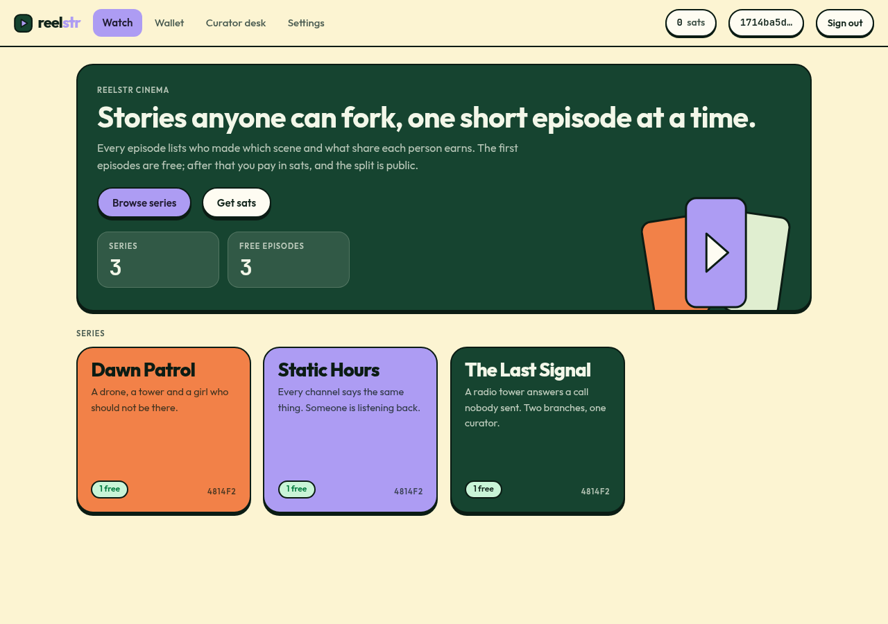
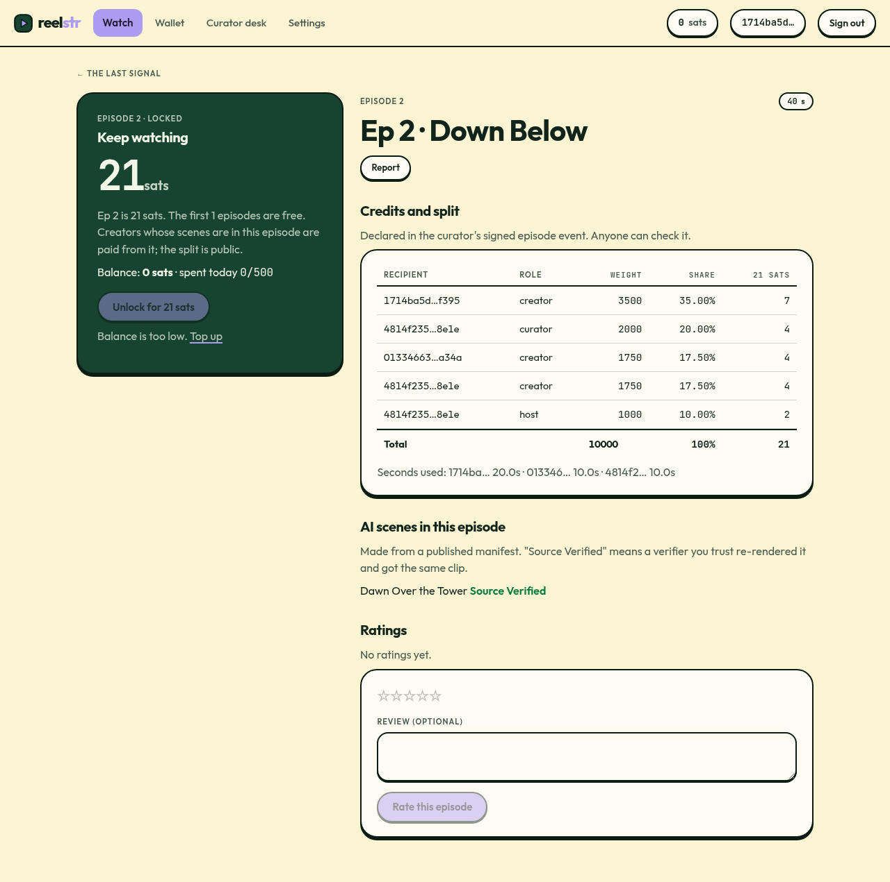
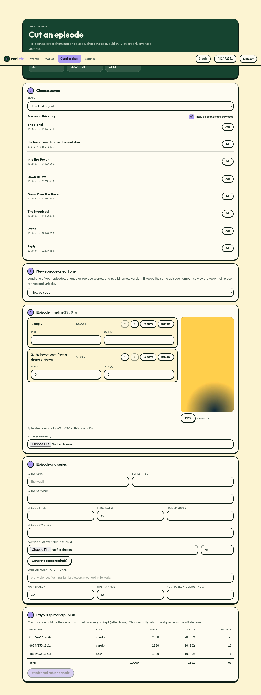
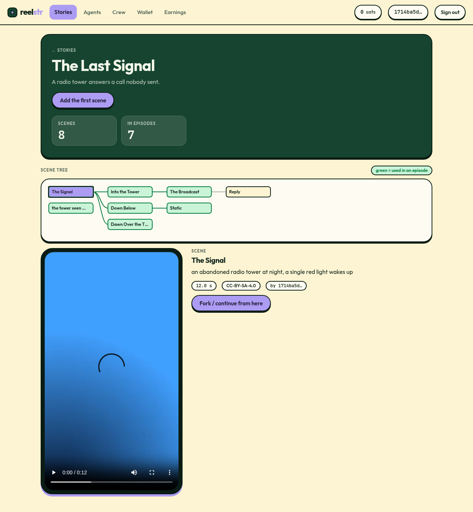
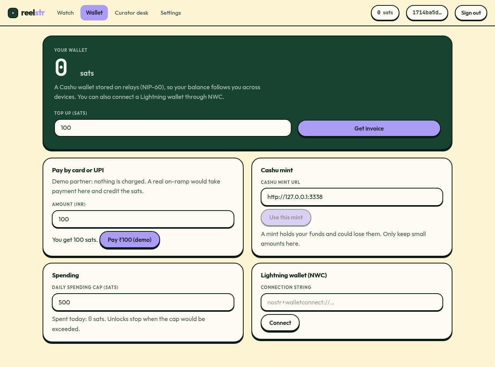
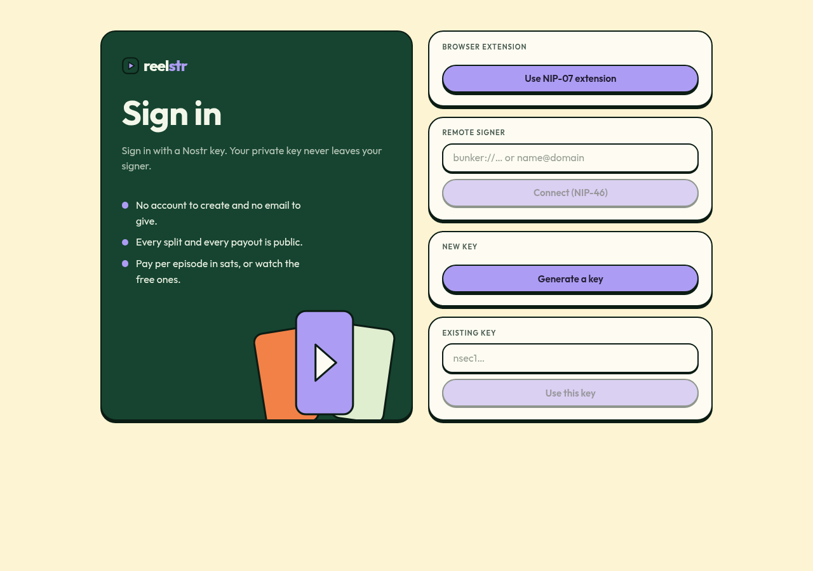
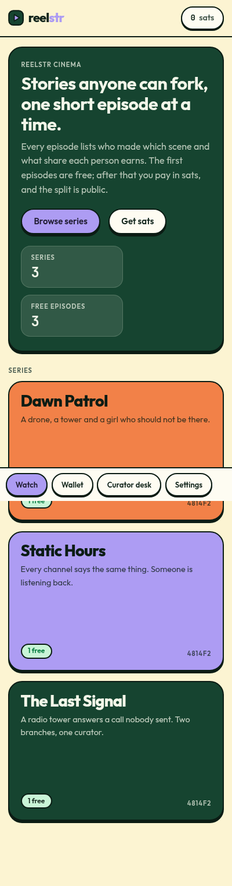

# Design system: Pine & Cream

The web app (Watch and Create tabs, plus the public landing page) uses one stylesheet, `packages/ui/src/theme.css`, and one shell, `packages/ui/src/shell.tsx`. The look is flat and warm: no glow, no glass, no blur. The numbers (sats, shares, seconds) carry the page and the colour stays out of their way.

## Rules

- **One ink.** `--ink` draws every border and every shadow, so a hard shadow and its outline always read as one object. Shadows are solid and unblurred.
- **Things press.** Buttons and covers move down by their shadow depth on `:active`, landing flush. That single transform is the tactility.
- **Four colour roles.** `--primary` (periwinkle) is identity and the main action. `--fair` (leaf green) means something was checked or is free, never decoration. `--accent` (orange) is the second action and ratings. `--hero` (deep pine) is one feature surface per page, never a signal.
- **Numbers are mono.** Every sat figure, duration, weight and key fragment is `.num` (JetBrains Mono, tabular), so money does not change width as it changes.
- **Type.** Outfit for the interface, self-hosted through `@fontsource-variable` (no request to a font CDN, which suits an app about not trusting third parties).
- **Voice.** State the fact, then get out of the way. "Declared in the curator's signed episode event. Anyone can check it."
- **Light only.** Tokens are `:root` custom properties, so a dark theme would be a class flip, but nothing needs one yet.

## Motion and navigation

- **One router** (`packages/ui/src/hooks.ts`) knows whether a navigation was forward or back (it keeps its own record of where you have been, since a hash change does not say). It tags `<html data-nav="forward|back">` and runs the change inside a browser **view transition**: the page slides and fades 28 px one way going forward and the other way going back, while the header and the bottom strip stay put.
- Forward starts at the top; back returns to where you were scrolled.
- **Back is one component** (`BackLink`): a pill that names where it goes, on every detail page and on sign-in. The arrow nudges left on hover.
- `prefers-reduced-motion` turns the transitions off, and browsers without view transitions simply change page.
- Loading shows flat pulsing placeholders instead of blank space, and the tab title follows the page.

## Landing page motion

Movement and fade only (the two things a browser animates without re-laying-out the page), no animation library.
- **Hero, on load (about 2 s):** the headline rises word by word; the middle film frame drops in and lands with a small bounce, two more slide out of it (a scene forking), the play triangle pulses once; the paragraph, buttons and chips follow.
- **On scroll:** each section arrives in a short stagger as it comes into view. In "How it works" the numbers pop in and a line draws from each card to the next. Anything already on screen at load waits for the hero to finish.
- **Small things:** feature cards lift when pointed at, the header gains a hard shadow once the page scrolls under it, and a flat diagonal highlight sweeps across the main button every few seconds.
- **Safe by construction:** reduced motion shows everything at once with no animation; content below the fold is only hidden when scroll-observing works, and a 12 s timer reveals anything still hidden.
- **To undo it:** `git revert` the landing-animation commit, or `git checkout before-landing-animation -- apps/web/src/Landing.tsx packages/ui/src/theme.css packages/ui/src/shell.tsx packages/ui/src/session.tsx`.

## Pieces

| Piece | Where |
| --- | --- |
| Tokens, buttons, inputs, tables, cards, hero, covers, phone frame, step numbers, bubbles | `theme.css` |
| Header, wallet chip, mobile pill bottom-nav, skip link, wordmark, film artwork | `shell.tsx` (`AppShell`, `Wordmark`, `FilmArt`) |
| Sign-in (pitch beside the four ways in) | `LoginGate` in `session.tsx` |
| Covers | Typography on a flat colour chosen from a hash of the series or story, because there is no artwork to show |

Below 760 px the header keeps the wordmark and the balance, and the destinations become a pill strip pinned to the bottom, where a thumb reaches.

## Screens

| | |
| --- | --- |
|  |  |
|  |  |
|  |  |

Regenerate them against the running demo with `bun demo/src/shots.ts <dir>` (rebuild the apps first with `bun demo/src/rebuild.ts`).

## Not done

- No real artwork or poster frames: covers are typographic. Poster extraction at render time would fix that.
- No dark mode, and no full accessibility audit beyond keyboard focus, labelled controls and contrast chosen from the reference palette.
- Reference: the Halfpot site's "Pine & Cream" brand guide, adapted for a media product.

## Mobile

The phone app is the same web build in a Capacitor shell (`apps/mobile`), so there is one design. At 760 px and below the primary tabs move to a bottom bar (`.bottomnav`, padded by `env(safe-area-inset-bottom)`), and the header is padded by `env(safe-area-inset-top)` so it clears the status bar and notch.
