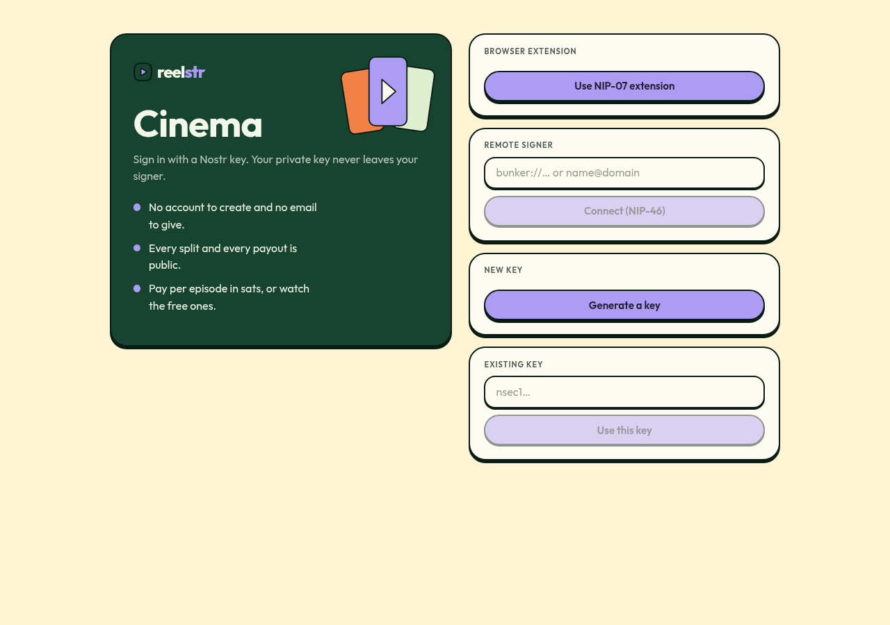

# Design system: Pine & Cream

Both apps (Cinema, Studio) share one stylesheet, `packages/ui/src/theme.css`, and one shell, `packages/ui/src/shell.tsx`. The look is flat and warm: no glow, no glass, no blur. The numbers (sats, shares, seconds) carry the page and the colour stays out of their way.

## Rules

- **One ink.** `--ink` draws every border and every shadow, so a hard shadow and its outline always read as one object. Shadows are solid and unblurred.
- **Things press.** Buttons and covers move down by their shadow depth on `:active`, landing flush. That single transform is the tactility.
- **Four colour roles.** `--primary` (periwinkle) is identity and the main action. `--fair` (leaf green) means something was checked or is free, never decoration. `--accent` (orange) is the second action and ratings. `--hero` (deep pine) is one feature surface per page, never a signal.
- **Numbers are mono.** Every sat figure, duration, weight and key fragment is `.num` (JetBrains Mono, tabular), so money does not change width as it changes.
- **Type.** Outfit for the interface, self-hosted through `@fontsource-variable` (no request to a font CDN, which suits an app about not trusting third parties).
- **Voice.** State the fact, then get out of the way. "Declared in the curator's signed episode event. Anyone can check it."
- **Light only.** Tokens are `:root` custom properties, so a dark theme would be a class flip, but nothing needs one yet.

## Pieces

| Piece | Where |
| --- | --- |
| Tokens, buttons, inputs, tables, cards, hero, covers, phone frame, step numbers, bubbles | `theme.css` |
| Header, wallet chip, mobile pill bottom-nav, skip link, wordmark, film artwork | `shell.tsx` (`AppShell`, `Wordmark`, `FilmArt`) |
| Sign-in (pitch beside the four ways in) | `LoginGate` in `session.tsx` |
| Covers | Typography on a flat colour chosen from a hash of the series or story, because there is no artwork to show |

Below 760 px the header keeps the wordmark and the balance, and the destinations become a pill strip pinned to the bottom, where a thumb reaches.

## Screens

| | |
| --- | --- |
|  |  |
|  |  |
|  |  |

Regenerate them against the running demo with `bun demo/src/shots.ts <dir>` (rebuild the apps first with `bun demo/src/rebuild.ts`).

## Not done

- No real artwork or poster frames: covers are typographic. Poster extraction at render time would fix that.
- No dark mode, and no full accessibility audit beyond keyboard focus, labelled controls and contrast chosen from the reference palette.
- Reference: the Halfpot site's "Pine & Cream" brand guide, adapted for a media product.
